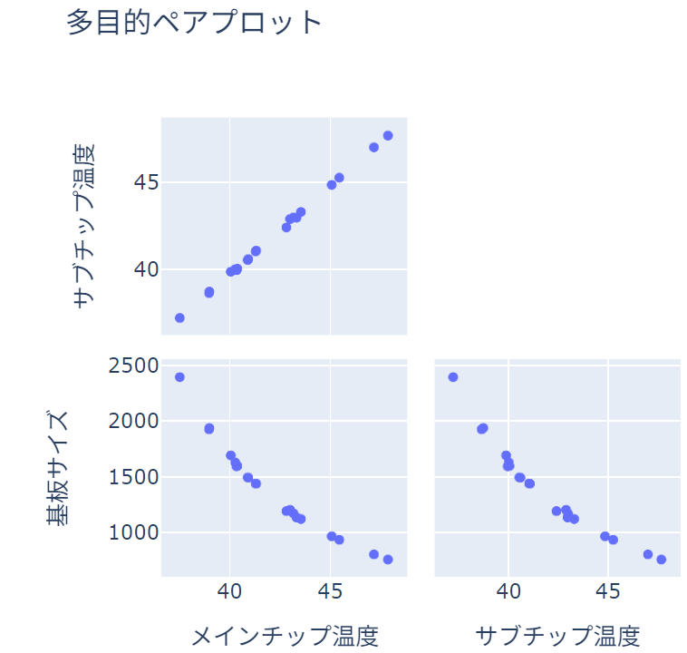

基板上の発熱体
===============

Femtet の熱伝導解析ソルバーを用い
基板上の IC チップの最高温度を最小にしつつ
基板のサイズを最小にする
基板寸法を探索する例題を解説します。

サンプルファイル
--------------------
.. note::

   :download:`サンプルプロジェクト<../../../pyfemtet/FemtetPJTSample/wat_ex14_parametric.femprj>`
   を Femtet で開いたまま、
   :download:`サンプルコード<../../../pyfemtet/FemtetPJTSample/wat_ex14_parametric.py>`
   をダブルクリックして実行してください。

.. note::

   FEM 問題としての詳細については、FemtetHelp / 例題集 / 熱伝導解析 / 例題14 を参照してください。

設計変数
---------------

.. figure:: wat_ex14_model.png
   
   モデルの外観

===========  ============
  変数名         説明
===========  ============
substrate_w  基板の幅
substrate_d  基板の奥行き
===========  ============

目的関数
---------------

- メインチップの最高温度（最小にする）
- サブチップの最高温度（最小にする）
- 基板の平面上の専有面積（最小にする）

サンプルコード
---------------

.. literalinclude:: ../../../pyfemtet/FemtetPJTSample/wat_ex14_parametric.py
   :language: python
   :linenos:
   :caption: wat_ex14_parametric.py

サンプルコードの実行結果
-------------------------

   wat_ex14_parametric.py の実行結果。
   各目的関数の組み合わせが縦軸、横軸となる
   ペアプロットです。

20 回目の試行の結果、以下のことがわかります。

- メインチップ温度とサブチップ温度は片方を小さくしてももう片方も小さくできる
- 基板サイズを小さくすると、メインチップ温度は大きくなってしまう
- 基板サイズを小さくすると、サブチップ温度は大きくなってしまう

このことから、メインチップとサブチップはともに温度を最小化する設計が可能であるのに対し
それぞれのチップ温度と基板サイズはトレードオフの関係にあり、これらの最小化は両立しないことがわかります。

.. tip::

   多目的最適化では、目的関数同士の最適化が両立しないことがあります。
   こうした場合、設計者が各トレードオフ解の中から
   適した設計を選択する必要があります。

.. note::

   こうしたトレードオフが生じる物理的理由は最適化アルゴリズムからは導けないため、
   設計者が Femtet の解析結果を分析するなどして解釈する必要があります。

今回の問題では、基板サイズが小さくなったことで環境への放熱能力が小さくなり、
熱が基板から逃げないためにチップ温度が上昇しているものと考察できます。

.. note::

   Femtet, pyfemtet および依存する最適化エンジンのバージョンにより、結果は多少異なる場合があります。
