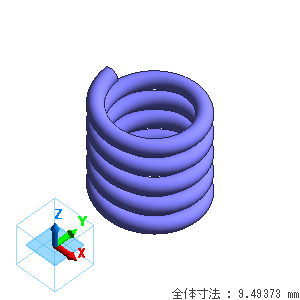

ソレノイドコイルの自己インダクタンス
=====

Femtet の磁場解析ソルバーを用い、有限長ソレノイドコイルの
自己インダクタンスを特定の値にする例題を解説します。

サンプルファイル
-----
.. note::

   サンプルプロジェクトを Femtet で開き、サンプルコードを実行してください。

   :download:`サンプルプロジェクト<../../pyfemtet/FemtetPJTSample/gau_ex08_parametric.femprj>`
   :download:`サンプルコード<../../pyfemtet/FemtetPJTSample/gau_ex08_parametric.py>`

.. note::

   FEM 問題の詳細については、FemtetHelp / 例題集 / 磁場解析 / 例題8 を参照してください。

設計変数
-----

   
====== ======
変数名 説明
====== ======
h      1巻きあたりのピッチ
r      コイルの半径
n      コイルの巻き数
====== ======

目的関数
-----

自己インダクタンス

サンプルコード
-----

.. literalinclude:: ../../pyfemtet/FemtetPJTSample/gau_ex08_parametric.py
   :language: python
   :linenos:
   :caption: gau_ex08_parametric.py

サンプルコードの実行結果
-----

.. figure:: gau_ex08_result.png

横軸が試行回数、縦軸が自己インダクタンスです。20 回の試行で自己インダクタンスは　に収束しています。   

