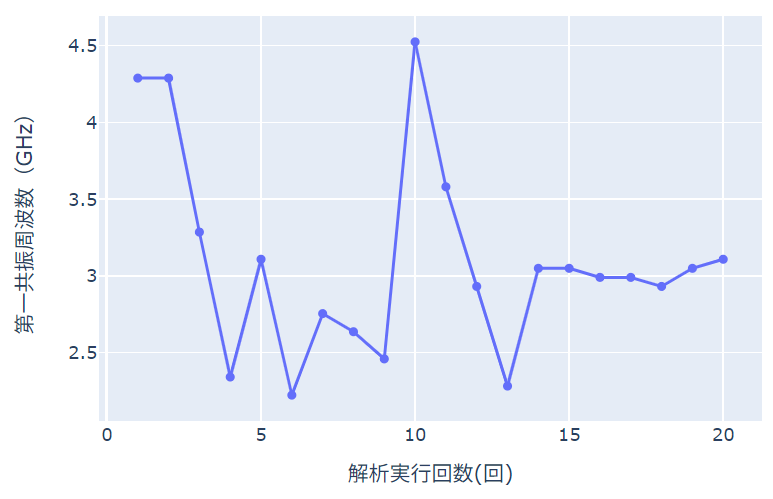

円形パッチアンテナの共振周波数
==============================

Femtet の電磁波解析ソルバーを用い、
円形パッチアンテナの共振周波数を
特定の値にする例題を解説します。

サンプルファイル
------------------------------
.. note::

   :download:`サンプルプロジェクト<../../pyfemtet/FemtetPJTSample/her_ex40_parametric.femprj>`
   を Femtet で開いたまま、
   :download:`サンプルコード<../../pyfemtet/FemtetPJTSample/her_ex40_parametric.py>`
   をダブルクリックして実行してください。

.. warning::

   この事例の実施には `BoTorch` ライブラリが必要です。
   下記いずれかのコマンドで `BoTorch` ライブラリのインストールを行ってから
   実施してください。
   ``py -m pip install botorch`` 又は 
   ``py -m pip install pyfemtet[all_methods]``

   BoTorch ライブラリを使用しない場合は、プログラム内のコメントに従って
   一部を修正してください。ただし、収束が遅くなる場合があります。

.. note::

   FEM 問題としての詳細については、FemtetHelp / 例題集 / 電磁波解析 / 例題40 を参照してください。

設計変数
------------------------------

.. figure:: her_ex40_model.png
   
   モデルの外観

====== ======
変数名 説明
====== ======
ant_r  円形アンテナの半径
sx     基板のサイズ
xf     給電ポートの位置
====== ======

目的関数
------------------------------

S(1,1) の第一ピークを与える共振周波数

サンプルコード
------------------------------

.. literalinclude:: ../../pyfemtet/FemtetPJTSample/her_ex40_parametric.py
   :language: python
   :linenos:
   :caption: her_ex40_parametric.py

サンプルコードの実行結果
------------------------------

   her_ex40_parametric.py の実行結果。
   横軸が試行回数、
   縦軸が共振周波数です。

17 回目の試行の結果、
共振周波数は
2.991 GHz となります。

.. note::

   Femtet, pyfemtet および依存する最適化エンジンのバージョンにより、結果は多少異なる場合があります。
