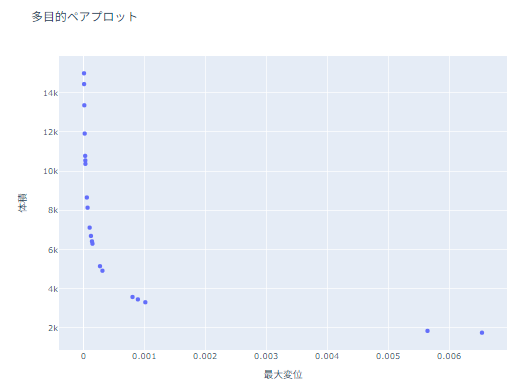

Welcome to PyFemtet's documentation!
====================================

**pyfemtet** はマルチフィジックス有限要素法解析ソフト
`Femtet <https://www.muratasoftware.com/>`_ において
まとまった機能の Python インターフェースを提供するパッケージです。

現在 **pyfemtet** の唯一のサブパッケージ **opt** は
設計のパラメータ最適化を行う *シンプルな* API を提供します。

シンプルな API
--------------

下記の短いスクリプトにより多目的最適化が実行され、進行状況を表すモニターが起動します。

.. code-block:: python

   from pyfemtet.opt import OptimizerOptuna

   def max_displacement(Femtet):
       dx, dy, dz = Femtet.Gogh.Galileo.GetMaxDisplacement()
       return dy

   def volume(Femtet):
       w = Femtet.GetVariableValue('w')
       d = Femtet.GetVariableValue('d')
       h = Femtet.GetVariableValue('h')
       return w * d * h

   if __name__ == '__main__':
       femopt = OptimizerOptuna()
       femopt.add_parameter('w', 10, 2, 20)
       femopt.add_parameter('d', 10, 2, 20)
       femopt.add_objective(max_displacement, name='最大変位', direction=0)
       femopt.add_objective(volume, name='体積', direction='minimize')
       femopt.set_random_seed(42)
       femopt.main(n_trials=20)

.. note::

   :download:`サンプル（opt_sample.femprj） <opt_sample.femprj>` をダウンロードし、Femtet で開いた状態で上記スクリプトを実行してください。

.. image:: ./opt_sample.png
   :scale: 50%
最適化する問題。図の下端が固定、上端が固定値の荷重。

設計変数：対面の幅（w）及び奥行（d）。

目的関数：最大変位が 0 に近いこと、及び体積が最小に近いこと。

実行結果
--------------

最適化結果。

体積が小さいほど変位が大きくなり、2 つの目的関数はトレードオフの関係にあることがわかる。

詳細は :doc:`usage` セクションを確認してください。

Contents
--------

.. toctree::

   Home <self>
   usage.md
   api

Copyright (C) 2023 Murata Manufacturing Co., Ltd. All Rights Reserved.
Everyone is permitted to copy and distribute verbatim copies of this license document, but changing it is not allowed.