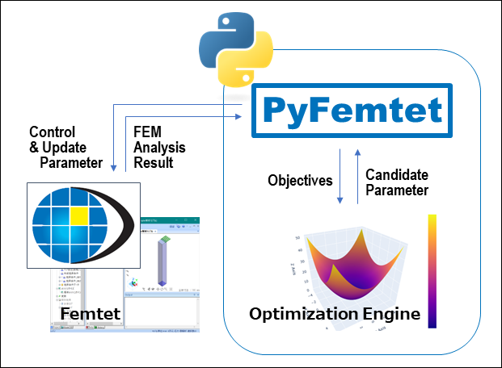

# Welcome! PyFemtet is the extension package for Femtet.

## Main Features



> [!NOTE]
> For details, see the documentation of "Related Pages" section.

### Design Parameter Optimization
- Single or multiple objective optimization
- Progress monitor GUI
- Parallel computation with controling multiple Femtet processes
- Result output in easy-to-analyze csv format for Excel and other tools

### Dispatch Extensions
- Create `CFemtet` object with process ID specification

## Related Pages

- Femtet Website: https://www.muratasoftware.com/
- Documentation (English): https://pyfemtet.readthedocs.io/en/stable/
- ドキュメント（日本語）: https://pyfemtet.readthedocs.io/ja/stable/
- Source code: https://github.com/pyfemtet/pyfemtet
- Bug reports: https://github.com/pyfemtet/pyfemtet/issues


## Getting Started

> [!NOTE]
> Currently Femtet and `pyfemtet` supports **Windows only**.

### 1. Install Femtet

- Access [Murata Software Website](https://www.muratasoftware.com/) and get **Femtet trial version** or purchase a lisence.
- Get installer and launch it.
- **Run 'EnableMacros'** from the start menu.
> [!NOTE]
> This procedure requires administrator privileges.


### 2. Install PyFemtet

> [!NOTE]
> The commands on this section are for `CMD` or `PowerShell` on with `py launcher`.
> For a virtual environment, replace `py` to `python`.
> If you do not have Python, please install it first.

- Get `pyfemtet` via following command:

    ```py -m pip install pyfemtet```


### 3. Setting `win32com` Constants

- Run following command to enable COM constants:

    ```py -m win32com.client.makepy FemtetMacro```
    
That's all! Now you can use Femtet's extention features via `pyfemtet`.
For more information including sample code and FEM projects, see the documentation of "Related Pages" section.
