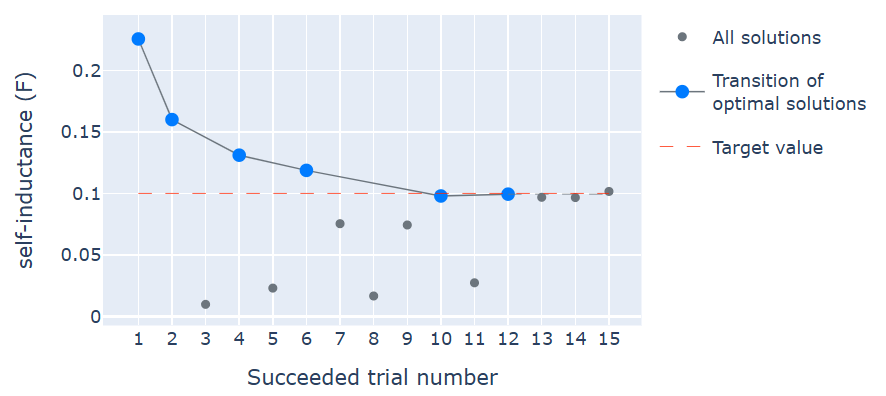

Self-inductance of a solenoid coil
========================================

An example will be explained using Femtet's magnetic field analysis solver to determine the self-inductance of a finite-length solenoid coil to a specific value.

Sample File
------------------------------
.. note::

   Keep the :download:`sample project<../_temporary_sample_files/gau_ex08_parametric.femprj>`
   open in Femtet and double-click on the :download:`sample code<../_temporary_sample_files/gau_ex08_parametric.py>`
   to execute it.

.. note::

   For more details on the FEM problem, please refer to FemtetHelp / Example Collection / Magnetic Analysis / Example 8.

Design Variables
------------------------------

.. figure:: gau_ex08_model.png
   
   Appearance of the Model

============== ====================================
Variable Name  Description
============== ====================================
h              Pitch per 1 turn
r              Radius of the coil
n              Number of turns in the coil
============== ====================================

Objective Function
------------------------------

Self-inductance of the coil.

Sample Code
------------------------------

.. literalinclude:: ../_temporary_sample_files/gau_ex08_parametric.py
   :language: python
   :linenos:
   :caption: gau_ex08_parametric.py

Execution Result of the Sample Code
-------------------------------------

   Execution result of gau_ex08_parametric.py. The horizontal axis is the number of iterations, and the vertical axis is self-inductance.

After 20 iterations, the self-inductance was calculated to be 0.103 µF.

.. note::

   Results may vary slightly depending on the versions of Femtet, PyFemtet, and the optimization engine it depends on.
