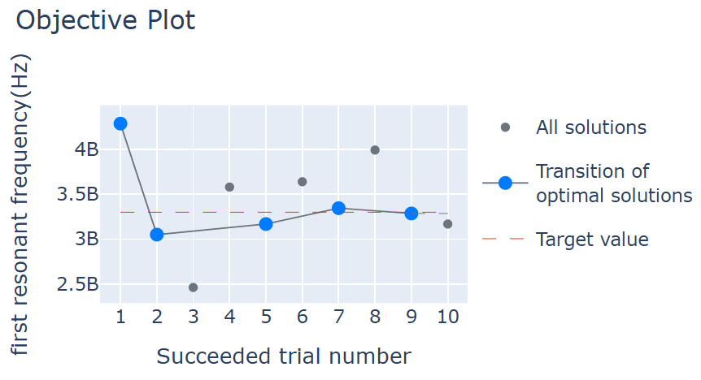

Resonant frequency of a circular patch antenna
==================================================

Using Femtet's electromagnetic wave analysis solver, we explain an example of setting the resonant frequency of a circular patch antenna to a specific value.

Sample File
------------------------------
.. note::

   Keep the :download:`sample project<../_temporary_sample_files/her_ex40_parametric.femprj>`
   open in Femtet, and double-click on the :download:`sample code<../_temporary_sample_files/her_ex40_parametric.py>`
   to execute it.

.. note::

   For details on the FEM problem, please refer to FemtetHelp / Examples / Electromagnetic Wave Analysis / Example 40.

Design Variables
------------------------------

.. figure:: her_ex40_model.png
   
   Appearance of the Model

============== ============
Variable Name  Description
============== ============
ant_r          Radius of the circular antenna
sx             Size of the substrate
xf             Power port location
============== ============
 

Objective Function
------------------------------

Resonant frequency giving the first peak of S(1,1)

Sample Code
------------------------------

.. literalinclude:: ../_temporary_sample_files/her_ex40_parametric.py
   :language: python
   :linenos:
   :caption: her_ex40_parametric.py

Execution Result of the Sample Code
-------------------------------------

   Execution result of her_ex40_parametric.py. The horizontal axis is the number of iterations, and the vertical axis is the resonant frequency.

After 20 iterations, the the best frequency was calculated to be 2.991 GHz.

.. note::

   Results may vary slightly depending on the versions of Femtet, PyFemtet, and the optimization engine it depends on.
