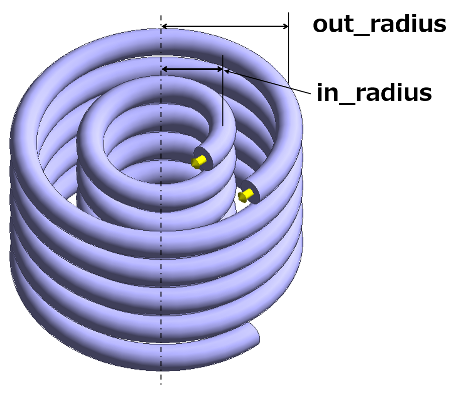
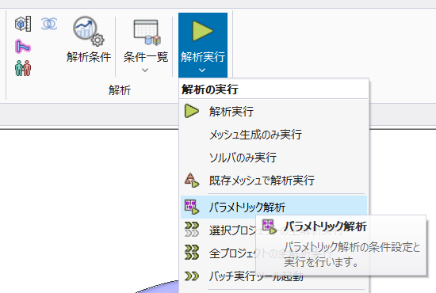

Parametric Output as Objective
==============================

This example explains how to use the output settings
of parametric analysis of Femtet as objective functions.

Motivation
----------

With PyFemtet, you can perform optimization
with low code. However, you have to code the
objective function by using Femtet Python Macro.
With this function, you can use the results set
on the Femtet GUI as the objective function for
optimization without coding the objective function.

Sample Files
------------

.. note::

   Keep the :download:`sample project<../_temporary_sample_files/gau_ex12_parametric.femprj>`
   open in Femtet and double-click on the :download:`sample code<../_temporary_sample_files/gau_ex12_parametric.py>`
   to execute it.

Note
----

.. warning::

   This feature;

   - removes existing sweep table of parametric analysis from your project file.
   - uses only the first component of the vector / complex output (e.g. X component / real part.).

Design Variables and Analysis Conditions
----------------------------------------

   Model appearance, analysis conditions and design variables

============== ====================================
Variable Name  Description
============== ====================================
out_radius     The radius of outer coil.
in_radius      The radius of inner coil.
============== ====================================

Objective Function
------------------

1. mutual inductance (aim to 150 nH)
2. Z component of magnetic field at the center of the coils (minimize)

Sample Code
-----------

.. literalinclude:: ../_temporary_sample_files/gau_ex12_parametric.py
   :language: python
   :linenos:
   :caption: gau_ex12_parametric.py

Execution Result of the Sample Code
-----------------------------------

.. figure:: result.png
   :width: 300

   Execution result of gau_ex12_parametric.py.
   There is no codes about objective function calculation
   but the optimization correctly uses the output settings
   as its objective functions.

.. note::

   Results may vary slightly depending on the versions of Femtet,
   PyFemtet, and the optimization engine it depends on.

(Reference) How to Set Output on Femtet
---------------------------------------

   Open the dialog from here.

.. figure:: how_to_set_output.png
   :width: 400

   Open 'output', press 'add',
   (then choose items you want to get as output,)
   and press 'save'.

For more detail, see the Femtet's help.
