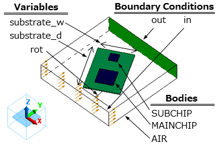
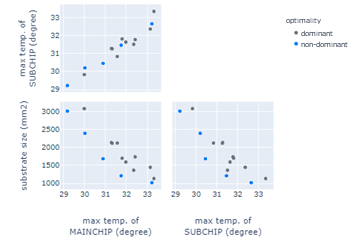

Air cooling of IC.
===================================

.. |SAMPLE_NAME| replace:: paswat_ex1

Using Femtet's simple fluid-thermal analysis solver,
we explain an example of searching for the substrate dimensions and its angle
that minimize the size of the substrate while keeping the maximum temperature of an IC chip on the substrate to a minimum.

.. note::

   Related example: :doc:`../wat_ex14/wat_ex14`

Sample File
--------------------
.. note::

   Keep the :download:`sample project<../_temporary_sample_files/paswat_ex1_parametric.femprj>`
   open in Femtet, and double-click on the :download:`sample code<../_temporary_sample_files/paswat_ex1_parametric.py>`
   to execute it.

.. note::

   For details on the FEM problem, please refer to FemtetHelp / Examples / Simple Fluid-Thermal Analysis / Example 1.

Design Variables
------------------

   
   Appearance of the Model

============== ==================================
Variable Name  Description
============== ==================================
substrate_w    Width of the substrate
substrate_d    Depth of the substrate
rot            Rotation angle of the substrate
============== ==================================

Objective Function
-----------------------------

- Maximum temperature of the main chip (to minimize)
- Maximum temperature of the sub chip (to minimize)
- Occupied area on the substrate plane (to minimize)

Sample Code
---------------

.. literalinclude:: ../_temporary_sample_files/paswat_ex1_parametric.py
   :language: python
   :linenos:
   :caption: |SAMPLE_NAME| _parametric.py

Execution Result of the Sample Code
--------------------------------------------------

   Execution result of |SAMPLE_NAME| _parametric.py. This is a pair plot with the combination of each objective function on the vertical axis and horizontal axis.

From the results of the 15 trials, the following can be observed.

**UNDER_CONSTRUCTION!!!!!!!!!!!!!!!**

.. tip::

   In multi-objective optimization, it is possible that the optimization of objective functions may not be compatible. In such cases, the designer needs to select the appropriate design from among the trade-off solutions.

.. note::

   Since the physical reasons for these trade-offs cannot be derived from optimization algorithms, designers need to interpret the analysis results of Femtet.

.. note::

   Results may vary slightly depending on the versions of Femtet, PyFemtet, and the optimization engine it depends on.
