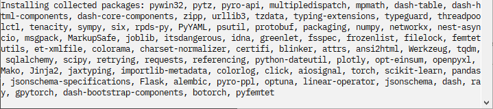

Manually Install PyFemtet
=========================

Launch command prompt
---------------------

.. figure:: launch_cmd.png

Input install command
---------------------

Run following command.

    (Only PyFemtet core library:)::

        py -m pip install pyfemtet --no-warn-script-location

    (With GUI tool to build script:)::

        py -m pip install pyfemtet-opt-gui --no-warn-script-location

.. figure:: pip_on_cmd.png

.. note::

    PyFemtet core library is published under MIT,
    but the GUI tool is published under LGPL-v3.

Wait for installation
---------------------

- Depending on the environment, the following installation screen may be displayed and may not change for several minutes or even several tens of minutes.

    Installation Screen

- Wait until the "Installed successfully..." message appears on the screen.

.. figure:: pip_complete_install.png    

If you want to check the installation, please check the section below.

- :ref:`Check the installation of PyFemtet <check-the-installation-pyfemtet-section>`
