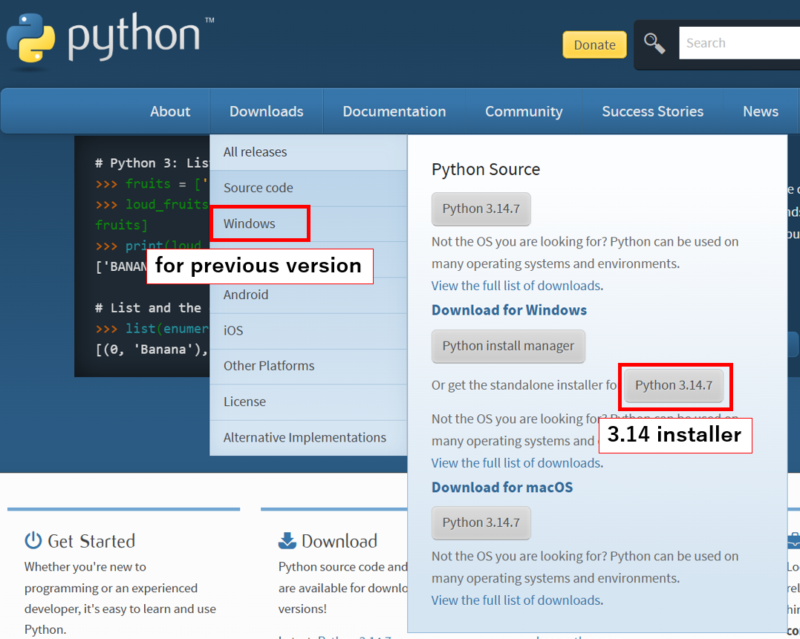

.. |Python| raw:: html

    <a href="https://www.python.org/" target="_blank">python.org</a>

Install Python
==============

Download the Windows 64-bit installer for a supported Python version
(3.10 to 3.14) and run it.

For a shared PC, install Python for all users so that the ``py`` command is
available when the PyFemtet setup script is run with administrator privileges.

|Python|

    Open the **Downloads** menu and select **Windows**. Download the
    installer for the required Python version.

1. In the first installer window, select **Customize installation**.

    .. figure:: python-customize-installation.png

2. On the **Optional Features** screen, ensure that **py launcher** is
   selected. Select **for all users (requires admin privileges)**, then
   select **Next**.

    .. figure:: python-install-py-launcher-for-all-users.png

3. On the **Advanced Options** screen, select **Install Python <version>
   for all users**, then select **Install**.

    .. figure:: python-install-for-all-users.png

.. _check-the-installation-python-section:

Check the Installation of Python
--------------------------------

If you want to check the installation later, please follow the steps below.

1. Press the Windows key and open the Command Prompt.

    .. figure:: launch_cmd.png

2. Run ``py --version``.

3. Confirm that a supported Python version (3.10 to 3.14) is displayed.

   If no version is displayed, run the command from a Command Prompt with
   administrator privileges and confirm that Python was installed for all users.
   If you see the message ``'py' is not recognized as an internal or external
   command, operable program or batch file.``, Python may not be installed.

    .. figure:: py_installed.png
