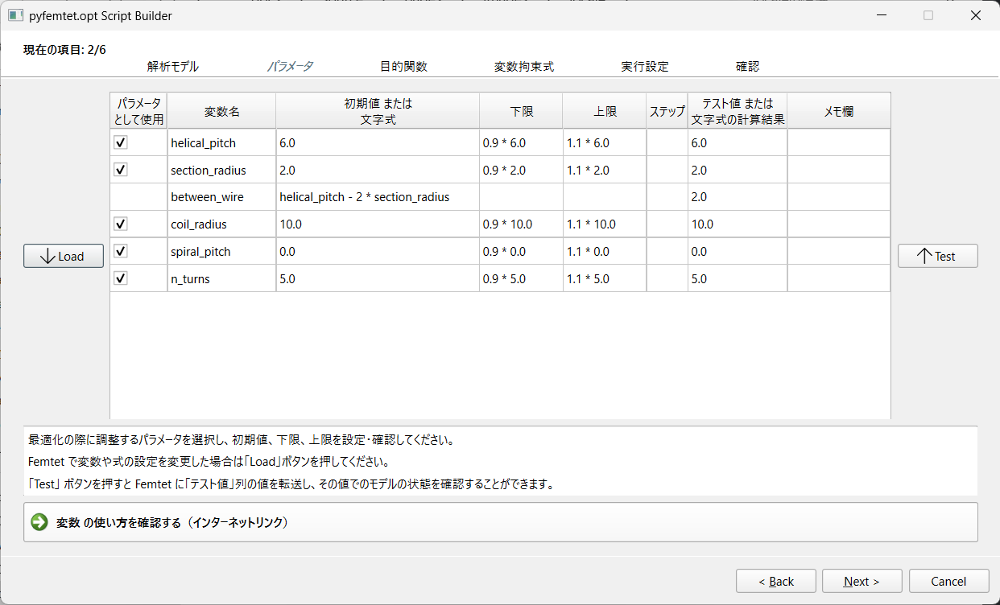

GUI
==============

``pyfemtet.opt`` has a GUI tool for script builder to run optimization: ``pyfemtet-opt-gui``.

Installation
------------

.. note:: 
    
    If you successfully ran `onestop-installer`, you already have the GUI tool.

    More information, see :doc:`installation_pages/install_pyfemtet` or :ref:`manualinstallation` .

Launch GUI
----------

Double click desktop icon.

.. figure:: images/pyfemtet-opt-script-builder-desktop-icon.png

.. note:: It may takes a long time for first time launching.

Usage
-----

Before launch tool, you prepare a .femprj file that define the FEM problem
with parametric modeling and parametric analysis output settings.

Then Launch the tool and setup optimization problem following the tool's explanation.

Finally, you will get a ``.py`` script to run optimization with your ``.femprj`` file.

.. _manualinstallation:
Manual Installation
-------------------

If you fail to install ``pyfemtet-opt-gui`` via `onestop-installer`, run::

    py -m pip install pyfemtet-opt-gui

If you have no icon on your desktop, search `pyfemtet-opt.exe` in `Scripts` folder of your python environment.

To check where your python environment is, run following command in `cmd`::

    py -c "import sys;print(sys.executable)"

The command above returns full path of your `python.exe` file.
Typically the `Scripts` folder exists in where the `python.exe` exists.
